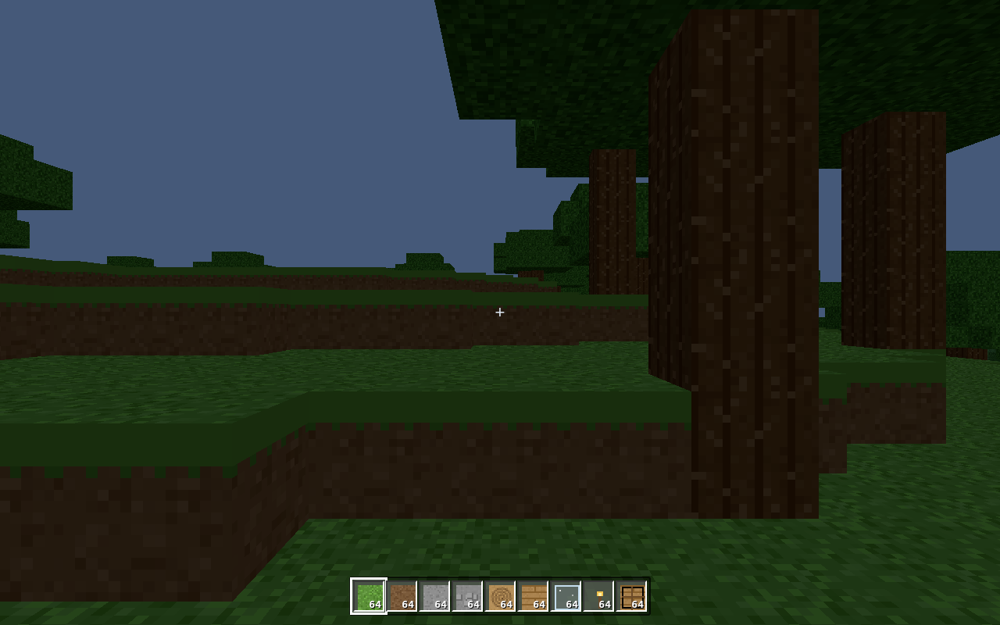

# ThreeCraft

A browser-based **Minecraft clone built with [Three.js](https://threejs.org/)**, aiming for
close fidelity to **Minecraft: Java Edition** — especially the movement/physics
model. No binary assets: every texture is generated procedurally at load time.



## Features

- **Survival & Creative modes.** Survival has health, hunger, saturation,
  drowning, fall damage, tool durability, and mob threats. Creative gives an
  infinite item palette and double-tap-space flight.
- **Procedurally generated, infinite world** from a seed: rolling hills,
  mountains, oceans, beaches, **caves** (3-D Perlin noise), depth-gated **ores**
  (coal → iron → gold → diamond), and trees.
- **Crafting** — a 2×2 grid in your inventory and the full 3×3 **crafting table**
  (shaped + shapeless recipes, horizontal-mirror invariant like Java).
- **Furnace** — smelt ores into ingots, cook food, turn sand into glass and
  cobblestone into stone. 200-tick (10 s) smelts and Java fuel burn times
  (coal = 8 items, planks = 1.5, stick = 0.5).
- **Tools** — wooden/stone/iron/golden/diamond pickaxes, axes, shovels, swords,
  each with the right harvest tier, mining speed, attack damage and durability.
  The Java mining-time formula is used exactly.
- **Mobs** — passive pigs and cows that wander and flee, and hostile zombies
  that spawn at night, chase, and attack in melee. All share the player's AABB
  physics with a 1-block auto-jump.
- **Java-accurate controls & physics** (see below).

## Minecraft Java parity

The simulation runs at a fixed **20 ticks per second**, one block = one metre,
with velocities in blocks-per-tick — exactly like Java. Constants live in
[`src/engine/constants.js`](src/engine/constants.js) and are verified by unit
tests:

| Quantity | Value |
| --- | --- |
| Eye height (standing / sneaking) | **1.62** / 1.27 blocks |
| Collision box | 0.6 × 1.8 blocks |
| Gravity / vertical drag | 0.08 / 0.98 per tick |
| Jump velocity → apex | 0.42 → **≈ 1.25 blocks** |
| Walk / sprint / sneak speed | **4.317 / 5.612 / 1.295 blocks/s** |
| Ground friction (slipperiness × drag) | 0.6 × 0.91 = 0.546 |
| Auto-step height | 0.6 (slabs/stairs, not full blocks) |

Horizontal motion uses the Java integrator `v' = v·friction + wish·accel`, whose
steady state `accel / (1 − friction)` reproduces the speeds above.

## Controls

| Input | Action |
| --- | --- |
| **WASD** | Move |
| **Space** | Jump · double-tap to toggle flight (creative) |
| **Shift** | Sneak / descend while flying |
| **Ctrl** or double-tap **W** | Sprint |
| **Left-click** | Break block (hold to mine) / attack mob |
| **Right-click** | Place block / use table or furnace / eat |
| **1–9**, mouse wheel | Select hotbar slot |
| **E** | Inventory (creative palette in creative mode) |
| **Q** | Drop selected item |
| **F3** | Debug overlay · **F5** camera · **Esc** pause |

## Running

```bash
npm install
npm run dev      # start Vite dev server, open the printed URL
```

Build a static bundle with `npm run build` (output in `dist/`), preview it with
`npm run preview`.

## Testing

```bash
npm test         # 41 Node unit tests for the pure game logic
```

The unit tests cover world-gen determinism, crafting/smelting, mining-time and
tool-tier drop rules, inventory stacking, and the physics constants/collision.
Browser smoke tests (Playwright) live in `tests/smoke.mjs` and `tests/ui.mjs`.

## Architecture

```
src/
  engine/
    constants.js   Java physics + world constants
    noise.js       seeded Perlin + fbm (deterministic)
    blocks.js      block registry, mining-time + drop rules
    items.js       item registry (blocks, tools, food, fuel)
    recipes.js     shaped/shapeless crafting + smelting
    furnace.js     furnace tick logic
    inventory.js   inventory + stacking model
    worldgen.js    terrain, caves, ores, trees
    world.js       chunk storage + block access
    physics.js     AABB voxel collision + Java movement math
    player.js      player state, physics tick, stats, camera
    mobs.js        entities + AI
    raycast.js     voxel ray casting (block selection)
    textures.js    procedural texture atlas
    chunkMesher.js chunk -> Three.js geometry (face culling)
  ui/
    hud.js         hotbar + health/hunger
    screens.js     inventory / crafting / furnace / creative
    icons.js, style.css
  game.js          orchestrator (renderer, loop, interaction)
  main.js          entry point
```

The `engine/` modules that hold game logic are free of DOM/Three.js imports so
they can be unit-tested under Node; rendering and UI live in the Three.js/DOM
layers.

## Scope & simplifications

This is a faithful *slice* of Minecraft, not the whole game. Notably: lighting
is a global day/night sun rather than per-block light propagation (torches are
bright but don't cast dynamic light), redstone/liquids-flow/biomes-variety are
out of scope, and the world is not persisted between reloads. See the PR
explainer doc for the full rationale.

## License

MIT
